# Yelp! I Got Food Poisoning!
### An Analysis of Restaurant Health InspectionGrades/Scores Versus Yelp Reviews

Photo by [Matheus Frade](https://unsplash.com/photos/KO46ZfbNdtY?utm_source=unsplash&utm_medium=referral&utm_content=creditCopyText) on [Unsplash](https://unsplash.com/@matheusfrade?utm_source=unsplash&utm_medium=referral&utm_content=creditCopyText)

### Angelenos love love LOVE food

From the amazing produce to the mix of immigrant flavors, Los Angeles has a strong food-focused culture.
Project goals:
1. Relevant to where audience lives
2. Topic anyone can relate to
3. Compare 2 diverse data sets
4. Make the data visual

### Do Health Inspections & Yelp Ratings Matter?

L.A.’s Department of Health checks everything from food temperatures to storage practices. Is there a correlation between inspection scores/grades and a restaurant’s overall Yelp rating?

Our gut says “yes” …

### Process
We combined 2 data sets and 19 calls to Yelp's API (in sets of 5,000) to create a 30 column/ 52,000 row CSV.

Our main data points involve inspection scores/grades and Yelp ratings. Turns out the average inspection ranks higher than most average restaurants. Then we looked at each restaurant.

When visualizing the Health Scores and the Yelp Reviews as heat maps, no trend is immediately apparent -- except that there are a lot of restaurants with good grades and good reviews in LA.

#### Health Score Map
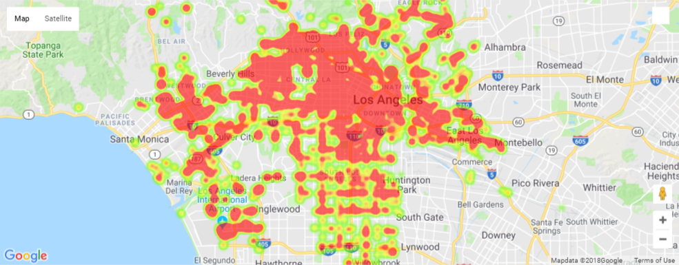

#### Yelp Review Map
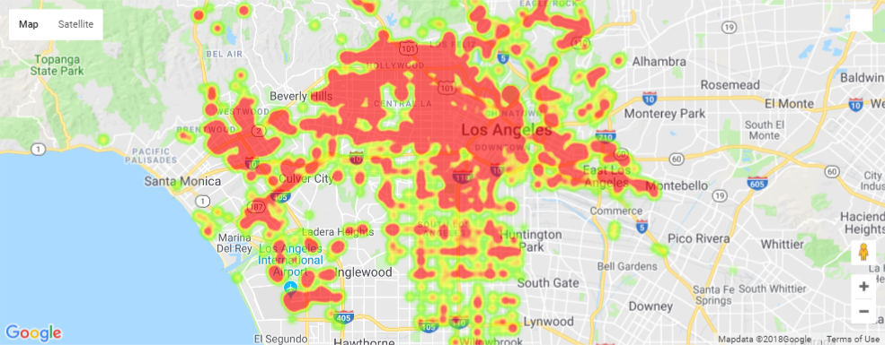

Since we saw no trend, we visualized the reviews according to Health Score. Again, no distinct trend emerges.

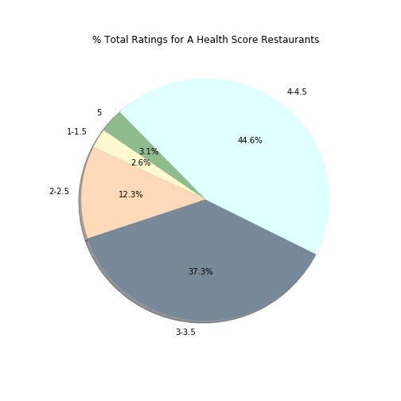 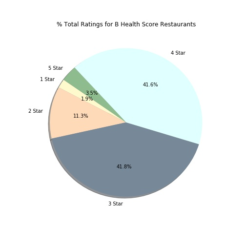 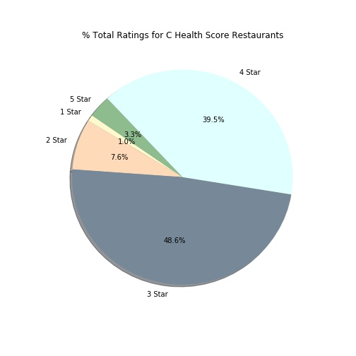

Ratings count, so we counted the ratings. Here is a look at the percentages by each star level:

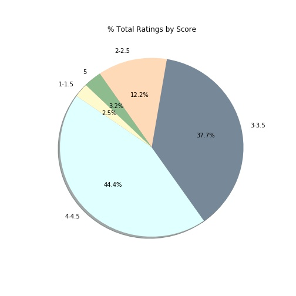

1-star = 863 ratings
2-star = 4,169 ratings
3-star = 12,860 ratings
4-star = 15,429 ratings
5-star = 1,079 ratings

Since our initial observations were not yielding much, we then performed statistical analysis to verify if there was, in fact, no corellation. Visualized below:

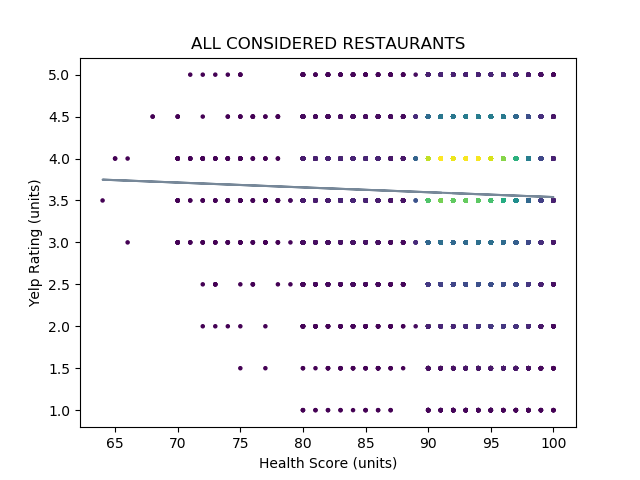

The densest part shows most health scores are in the low 90s (“A”) and most Yelp ratings are 4-stars. The line of best fit is, in fact, not a good fit as the data is spread everywhere.
Statisically speaking:

Since we were not seeing any health score correlation, we pivoted to price point. Distribution of restaurants in each $ group shows similar pattern in that majority are categorized in 3–4 ratings regardless of the price point.

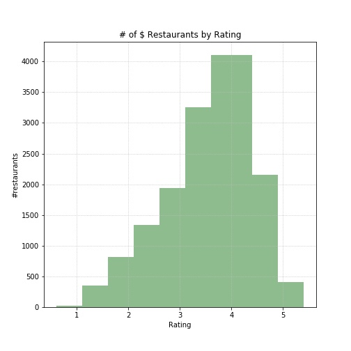 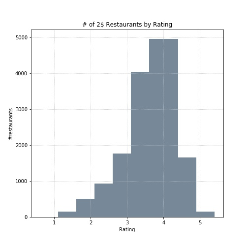 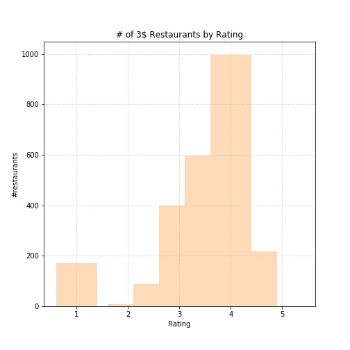 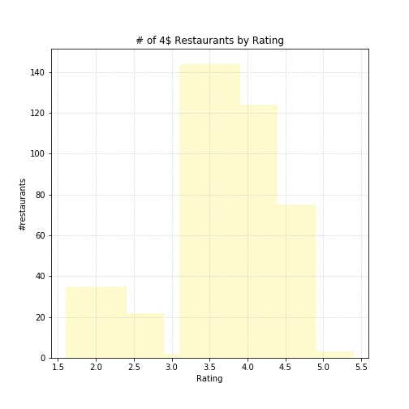